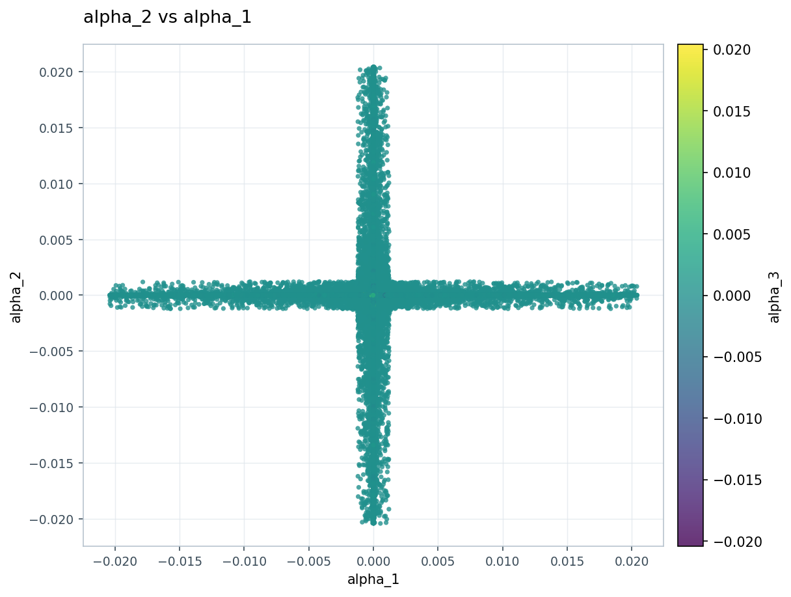
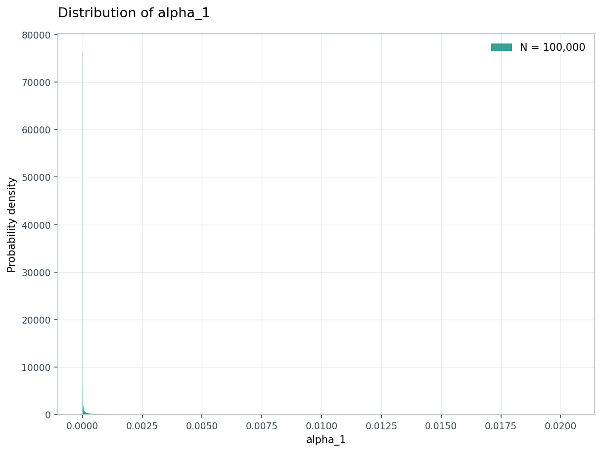

# Verification record

Date: 2026-09-19. Environment: Linux x86_64, CPython 3.12.14, Tk 8.6,
CustomTkinter 5.2.2, pandas 2.2.3, NumPy 2.3.5, Matplotlib 3.10.8.
The exact Python dependency snapshot is `constraints-python312.txt`.

## Executed checks

| Check | Result |
| --- | --- |
| Baseline recovered from interrupted session | All 30 existing tests passed; no interrupted file writes found |
| Final automated suite | 44 discovered: **42 passed, 2 desktop tests skipped** |
| Ruff lint and format checks | Passed across source, tests and benchmark tool |
| Python compilation | Passed across source, tests and benchmark tool |
| Clean virtual-environment installation | Package and pinned dependencies installed from scratch; `pip check` passed |
| Installed package imports and CLI | Passed from outside the source directory |
| Missing-display launch | Exits with status 1 and a clear desktop/Tk requirement message |
| Source distribution and wheel build | Built with setuptools through `python -m build` |
| Figure export | Real Agg rendering plus PNG/PDF/SVG creation and overwrite/error checks |
| Large supplied dataset | Full import, all-column statistics, correlations, selection, unsampled scatter, histogram and PNG export passed |

The coordinator integration test uses the real application coordination methods,
state, parser and worker queue with a headless view adapter. It verifies
cross-view notifications and preservation of active data/filters after a bad
replacement. It is **not** an execution of real Tk widgets.

## Regression coverage

Imports cover CSV quoting/multiline fields, malformed widths, whitespace-only
lines versus quoted empty records, encodings, decimal commas, duplicate/blank
headers, empty/header-only files, missing/infinite/mixed data, precision, dates and
cancellation. DAT coverage includes first-row preservation, explicit ordinary
headers after metadata comments, headerless data, literal apostrophes/backslashes,
quoted comments, doubled quotes and invalid quoting.

State/worker tests exercise atomic replacement, stale load/filter results,
read-only positional masks, cancellation, main-thread delivery, replacement jobs
and callback failures. Analysis tests cover known statistics, ddof conventions,
empty/single/constant columns, extreme values, categorical summaries and pairwise
correlations. Plot tests verify aligned rows, absolute/log transforms, exclusions,
deterministic sampling, full-data color normalization, annotation text/style,
shared inset normalization, histogram counts/density, range/bin validation,
one-sided bounds and tiny-value behavior. Export tests check computed-precision
round trips and preservation of previous output after failed writes.

## Supplied 200,000 × 61 CSV

One measured run; timings are environment-dependent and are not performance
guarantees. The original 216.68 MiB input is not copied into this release.
Machine-readable details are in `verification/benchmark.json`.

| Measurement | Observed |
| --- | ---: |
| Loaded shape | 200,000 rows × 61 numeric columns |
| Missing / infinite cells | 930 / 0 |
| Structural validation + import + profiling | 8.77 s |
| Committed dataframe memory | 93.08 MiB |
| Peak process RSS during this run | 578.06 MiB |
| Baseline process RSS | 78.61 MiB |
| Numeric summary across all 61 columns | 0.301 s |
| Correlations among first four columns | 0.016 s |
| Inclusive median filter | 100,000 selected rows |
| Committed selection-mask size | 0.191 MiB |
| Scatter array preparation, all 200,000 rows | 0.002 s |
| Scatter Agg draw, without sampling | 0.702 s |
| Scatter PNG export at 150 DPI | 0.919 s |
| Filtered histogram preparation | 0.007 s |
| Histogram Agg draw | 0.050 s |

The peak includes pandas parsing buffers and intermediate allocations; it is not
the steady-state dataframe size. An atomic replacement can additionally retain
the old dataset until the new candidate is ready. No full-dataframe copy is made
by state commit or by an individual tab.

A 10 ms main-thread heartbeat during background loading observed a 14.39 ms 95th
percentile interval and a 55.79 ms maximum interval. This confirms scheduling
availability during that load; it does **not** measure GUI interaction latency.

The generated scatter and histogram were visually inspected:

## Desktop verification still required

This environment has no display server. A local Xvfb attempt could not start
because Unix-socket creation returns `Operation not permitted`. Consequently,
real window startup, interactive dialogs, resizing, pan/zoom, native file dialogs
and visual layout have **not** been runtime-verified. No GUI screenshot is claimed.

`tests/test_gui.py` provides two real desktop integration tests: startup/dialog
construction/teardown/resizing, and all four areas with figures, statistics,
filters and dataset replacement. They run on a graphical desktop, or under
`xvfb-run -a python -m unittest discover -s tests -v` on a system permitting Xvfb.

For a manual desktop check:

1. Launch with `examples/scientific_demo.csv`; resize from 1000 × 680 to a larger
   window and visit each tab. Check control visibility and scrolling.
2. Choose numeric X/Y/color columns, set scientific/log/absolute options, and plot.
   Try invalid bounds and confirm the previous valid figure remains available.
3. Add/update/remove filters and annotations. Apply an inset, then pan/zoom/export
   PNG, PDF and SVG. Compare the figure and exported view.
4. Plot counts and density with linear/log bins, then compute all three statistics
   modes and export numeric results using both ddof conventions.
5. Replace the data with `mixed_demo.csv` and `whitespace_demo.dat`; confirm column
   selectors, filters, plot settings and results reset consistently. Try a bad
   file and cancel an import; verify the previous dataset remains active.
6. Repeat open/close of dialogs and plot replacement; close the application while
   a background task is running. Check for callback errors with `--debug`.

## Known limits

- Only CPython 3.12/Linux was exercised here. Python 3.10+ is declared; other
  Python versions and Windows/macOS need their own runtime checks.
- Large datasets must fit memory. Parsing buffers can substantially exceed the
  final dataframe size, and replacement temporarily retains both datasets.
- Cancellation cannot interrupt pandas' active C parser call. Process exit can
  wait for an already-running worker even after its result has been invalidated.
- Matplotlib drawing and export run on the GUI thread. Very dense figures can
  cause a brief pause; explicit sampling reduces the displayed/exported points.
- Numeric analysis uses float64. Integers beyond its exact-integer range and
  extreme dynamic ranges have the usual precision limits. The imported source
  dataframe retains its inferred dtype; plots/statistics use floating arrays.
- DAT multiline quoted fields, automatic date inference, arbitrary type coercion,
  missing-marker customization, saved workspaces and out-of-core analysis are not
  implemented. No chart or statistical test beyond the documented feature set
  is implied.
